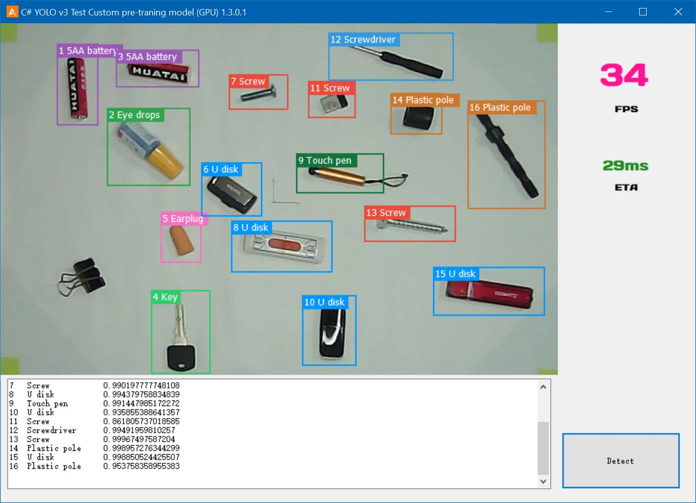
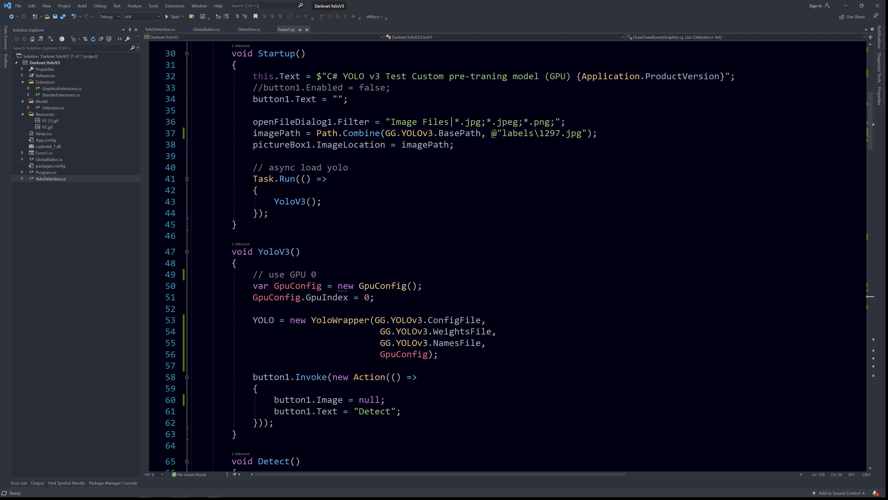

# Code in (4 steps) YOLOv3 in C#, Custom dataset, 30+ fps, faster & stable than python | 2020 AI Tech

https://www.youtube.com/watch?v=zQW1BMKHWoE&ab_channel=CoolooAI


<p>

</p>
<p>

</p>


## 1, Download all the files

## 2, Unzip the files by WinRAR via "Extract Here",

    1. /Darknet.YoloV3/cudnn64_7.zip
    2. /voc_custom/backup/yolov3_custom_63000.zip

## 3. Change the path in `GlobalSatics.cs`
## 4. Start and enjoy it


## PS: 

    1. I changed the `Alturos.Yolo.dll` and `yolo_cpp_dll_gpu.dll` to fix the issus, 
        so DO **NOT** use the default DLLs by nuget(You can use the nuget install the Alturos.YOLO package，
        and replace the dlls with mine).

    2. The `packages` files is modified by me.

    3. The `example` images are for testing.

    4. The `voc_custom` files are my custom training model.

## Issues Fixed 
    
### Error 1. System.DllNotFoundException - `Microsoft Visual C++ 2015-2019 Redistributable (x64)

    ```
    in `.\src\Alturos.Yolo\DefaultYoloSystemValidator.cs`, line: 51
    add more vc++ versions check, and recompile

    var checkKeys = new Dictionary ...
    {
        ...
        { @"Installer\Dependencies\VC,redist.x64,amd64,14.27,bundle", "Microsoft Visual C++ 2015-2019 Redistributable (x64)" },
        { @"Installer\Dependencies\VC,redist.x64,amd64,14.28,bundle", "Microsoft Visual C++ 2015-2019 Redistributable (x64)" },
        { @"Installer\Dependencies\VC,redist.x64,amd64,14.29,bundle", "Microsoft Visual C++ 2015-2019 Redistributable (x64)" }
    };
    ```
### Error 2. System.DllNotFoundException - Unable to load DLL 'yolo_cpp_dll_gpu.dll': The specified module could not be found.
prepare the `Yolo_cpp_dll.dll`(GPU mode), 
you can follow the tutorial in my channel here  
https://youtu.be/zT8eDXpslXw
1. complied the dll `Yolo_cpp_dll.dll`
2. prepare to replace it to the original `yolo_cpp_dll_gpu.dll`, KEEP with the original name `yolo_cpp_dll_gpu.dll`

### Error 3.  YOLO.Detect(File.ReadAllBytes(imagPath)); //System.NotImplementedException: 'C++ dll compiled incorrectly'

solution is here: https://bit.ly/33jVMLb